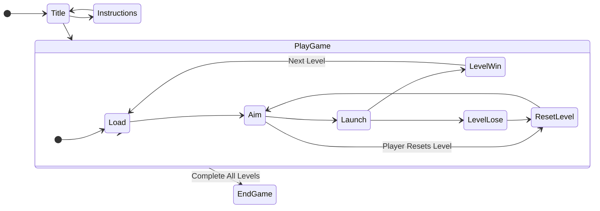

# TrickShotz
## A Physics-Based Puzzler

### Current Release:

A *demo release only*  of Trickshotz [231204-Prototype](https://github.com/nchpmn/TrickShotz/releases/tag/prototype-231204), based on commit `aa10ec4`.

---

### Roadmap

Whilst the demo/prototype published on Dec 2023 gives a good indication of the gameplay and style, the codebase was terrible.

A complete rewrite is currently underway, which is the code  in the main branch.

As a hobby project, there is no ETA for final publishing of the completed game.

---

### Program Outline

---

All Code and Assets Copyright Nathan Chapman / @nchpmn

Licenced as Open Source under GNU GPL 3.0, except as specified below:

- Arduboy2 Library by @MLXXXp, licenced under BSD 3-clause License. Dependencies of that library have various licences. https://github.com/MLXXXp/Arduboy2
- 3x5 Font by @filmote, licenced under BSD 3-Clause License. https://github.com/filmote/Font3x5